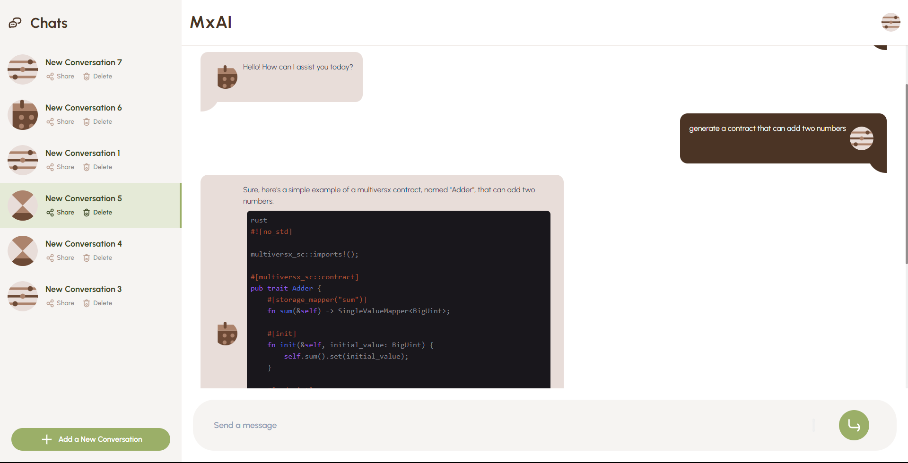
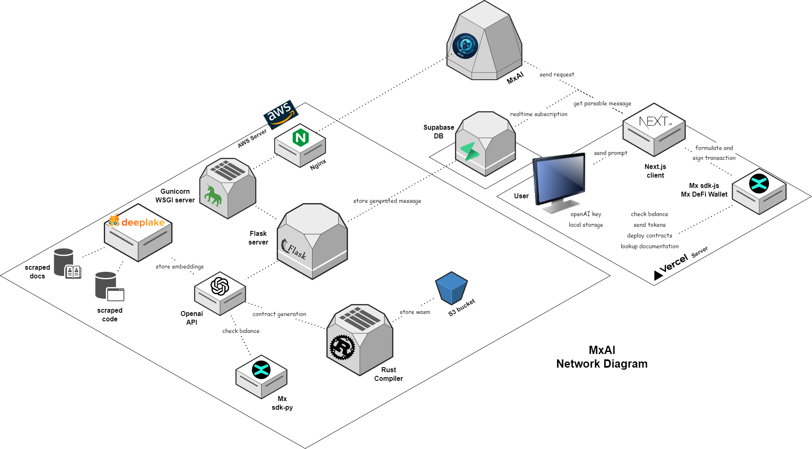
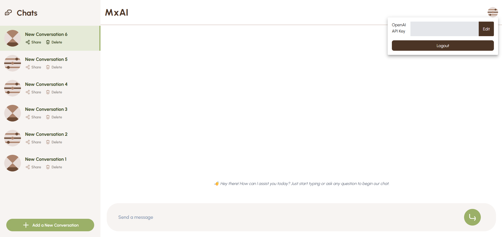

<!-- Improved compatibility of back to top link: See: https://github.com/CommanderAstern/encode-multiversX/pull/73 -->
<a name="readme-top"></a>
<!--
*** Thanks for checking out the encode-multiversX. If you have a suggestion
*** that would make this better, please fork the repo and create a pull request
*** or simply open an issue with the tag "enhancement".
*** Don't forget to give the project a star!
*** Thanks again! Now go create something AMAZING! :D
-->


<!-- PROJECT SHIELDS -->
<!--
*** I'm using markdown "reference style" links for readability.
*** Reference links are enclosed in brackets [ ] instead of parentheses ( ).
*** See the bottom of this document for the declaration of the reference variables
*** for contributors-url, forks-url, etc. This is an optional, concise syntax you may use.
*** https://www.markdownguide.org/basic-syntax/#reference-style-links
-->
[![Contributors][contributors-shield]][contributors-url]
[![Forks][forks-shield]][forks-url]
[![Stargazers][stars-shield]][stars-url]
[![Issues][issues-shield]][issues-url]
[![MIT License][license-shield]][license-url]


<!-- PROJECT LOGO -->
<br />
<div align="center">
  <a href="https://github.com/CommanderAstern/encode-multiversX">
    
  </a>

  <h3 align="center">MxAI</h3>

  <p align="center">
    Simplifying blockchain interaction for everyone!
    <br />
    <a href="https://github.com/CommanderAstern/encode-multiversX"><strong>Explore the docs »</strong></a>
    <br />
    <br />
    <a href="https://www.mxai.live/">View Demo</a>
    ·
    <a href="https://github.com/CommanderAstern/encode-multiversX/issues">Report Bug</a>
    ·
    <a href="https://github.com/CommanderAstern/encode-multiversX/issues">Request Feature</a>
  </p>
</div>

Important Links:
* [Pitch Deck](https://www.canva.com/design/DAFxuTABX-0/lCz7IkPDz8K4_CJQqnXCHA/edit?utm_content=DAFxuTABX-0&utm_campaign=designshare&utm_medium=link2&utm_source=sharebutton)
* [Presentation Video](https://youtu.be/VP0I5SaZLYg?si=2CMdhqvFdo8Olb8u)
* [Live Demo](https://www.mxai.live/)

Note - **You must provide an Openai API key on the website, for the chatbot to operate successfully!**

<!-- TABLE OF CONTENTS -->
<details>
  <summary>Table of Contents</summary>
  <ol>
    <li>
      <a href="#about-the-project">About The Project</a>
      <ul>
        <li><a href="#built-with">Built With</a></li>
      </ul>
    </li>
    <li>
      <a href="#getting-started">Getting Started</a>
      <ul>
        <li><a href="#prerequisites">Prerequisites</a></li>
        <li><a href="#installation">Installation</a></li>
        <li><a href="#backend">Backend Setup</a></li>      </ul>
    </li>
    <li><a href="#usage">Usage</a></li>
    <li><a href="#roadmap">Roadmap</a></li>
    <li><a href="#contributing">Contributing</a></li>
    <li><a href="#license">License</a></li>
    <li><a href="#contact">Contact</a></li>
    <li><a href="#acknowledgments">Acknowledgments</a></li>
  </ol>
</details>


<!-- ABOUT THE PROJECT -->
## About The Project



MxAI is a user-friendly chatbot designed to simplify and democratize blockchain technology. It reduces the steep learning curve for newcomers by providing an AI-driven interface that requires minimal technical expertise, while also streamlining repetitive and time-consuming processes for technical users. Our chatbot aims to make web3 accessible to everyone, contributing to the widespread adoption of blockchain technology.

Current features include:
* Generate, compile, and deploy code for blockchain applications
* Interact with ERC20 contracts
* Perform operations such as sending tokens and viewing balances of accounts
* Lookup Multiversx Documentation for guidance and information

<p align="right">(<a href="#readme-top">back to top</a>)</p>


### Built With



* [](https://nextjs.org/)
* [](https://tailwindcss.com/)
* [](https://supabase.com/)
* [](https://openai.com/blog/openai-api)
* [](https://www.nginx.com/)
* [](https://gunicorn.org/)
* [](https://flask.palletsprojects.com/en/3.0.x/)
* [](https://aws.amazon.com/)
* [](https://www.langchain.com/)
* [](https://www.deeplake.ai/)
* [](https://multiversx.com/)

We have used the following MultiversX sdks to build the project:
* [sdk-js](https://docs.multiversx.com/sdk-and-tools/sdk-js)
  * The wallet extension provider enables users to authenticate their MultiversX DeFi Wallet and authorize transactions.
  * Network providers to interact with the network and broadcast the transactions.
  * Utilized Code, SmartContract, and CodeMetadata classes to deploy smart contracts from hosted .wasm files.
  * ABI Registry to interact with smart contracts from hosted abi files.
* [sdk-py](https://docs.multiversx.com/sdk-and-tools/sdk-py/)
  * Query details about accounts such as balance, nonce etc.
* [mx-sdk-rs](https://github.com/multiversx/mx-sdk-rs)
  * Use the library to compile the generated contracts
* [Multiversx Defi Wallet Extension](https://chrome.google.com/webstore/detail/multiversx-defi-wallet/dngmlblcodfobpdpecaadgfbcggfjfnm)
<p align="right">(<a href="#readme-top">back to top</a>)</p>


<!-- GETTING STARTED -->
## Getting Started

This is an example of how you may give instructions on setting up your project locally.
To get a local copy up and running follow these simple example steps.

### Prerequisites

This is an example of how to list things you need to use the software and how to install them.
* npm
  ```sh
  npm install npm@latest -g
  ```
* Python (For Backend)
* Rust including cargo (For Backend)
### Installation

#### Frontend

- Set up Supabase:

  - Visit [Supabase](https://supabase.com/) and sign up for an account if you don’t already have one.

  - After signing up and logging in, create a new project.

  - Once your project is created, navigate to the 'API' section. Here, you will find your API keys: `supabaseUrl` and `anonKey`.

  - Note down these keys. You'll be needing them in subsequent steps.

- Clone the Repository:

  - Open your terminal or command prompt and execute the following commands:

    ```sh
    git clone https://github.com/CommanderAstern/encode-multiversX.git
    ``` 

  - This will clone the repository into a directory named "encode-multiversX".

- Install Necessary NPM Packages:

  - Before installing the packages, ensure you have [Node.js](https://nodejs.org/) and [NPM](https://www.npmjs.com/) installed on your machine.

  - Now, navigate to the frontend directory:

    ```sh
    cd encode-multiversX/frontend
    ```

  - Install the required packages:

    ```sh
    npm install
    ```

- Configure Environment Variables:

  - In the `frontend` directory, create an `.env.local` file.

  - Open `.env.local` in a text editor.

  - Add the following environment variables with the values that you obtained from the Supabase dashboard:

    ```sh
    NEXT_PUBLIC_SUPABASE_URL=your_supabase_url
    NEXT_PUBLIC_SUPABASE_ANON_KEY=your_anon_key
    ```

    Replace `your_supabase_url` and `your_anon_key` with the appropriate values.

  - Specify Your Backend's URL:

    Specify the URL where your backend is currently running.

    Open the `.env.local` file and add the following:

      ```sh
      NEXT_PUBLIC_BASE_URL=http://localhost:5000
      ```

    In the above example, the backend is assumed to be running locally on port `5000`. Replace `http://localhost:5000` with the actual URL where your backend is running.

  - Save and close the `.env.local` file.

- Run the Application:

    If you're ready to see your project in action, you can start the development server:

    ```sh
    npm run dev
    ```

    Visit `http://localhost:3000` in your browser to see the application running.

<p align="right">(<a href="#readme-top">back to top</a>)</p>

### Backend

To install the backend, follow the steps below:

1. Go to the backend directory
   ```sh
   cd backend
   ```
2. Create an env file and add the following variables
   ```sh
   cp env.example .env
   ```
3. Install the requirements
   ```sh
    pip install -r requirements.txt
    ```
4. Install Rust Mx Library
    ```sh
    cargo install multiversx-sc-meta
    ```
5. Run the backend using gunicon
    ```sh
    gunicorn app:app -w 3 --timeout 120    
    ```

<!-- USAGE EXAMPLES -->
## Usage

- Create an Account

  - Open your web browser and navigate to: 

  ```
  http://mxai.live/signup
  ```

  - Follow the on-screen instructions to create an account.

- Configure OpenAI API Key

  - After logging in, look for a user icon or profile picture on the top right corner of the web page.

  - Click on it. A modal (popup window) will appear.

  - Within this modal, you'll find an input field to add your OpenAI API key. Paste your OpenAI API key into the designated field.

  - Save to ensure your key is stored.

  

- Set Up MultiversX Wallet Extension

  Before proceeding, ensure you have the MultiversX Wallet browser extension:

  - If you haven't installed the MultiversX Wallet extension, download and install it from the respective browser's extension store.

  - Once installed, click on the MultiversX Wallet icon in your browser's toolbar.

  - Log in or set up your wallet account.

- Start Typing!

  With everything set up, you're ready to interact with the application. Start typing in the designated area, and watch as the magic happens!

#### Sample Prompts:

- I would like to send a transaction of 1000 to `wallet_address`
- What is the balance of `wallet_address`?
- Can you generate a contract that let's you add two numbers and also holds the number 8 which you can increment?
- Can you tell me about the extension wallet provider in multiversX?
- I'd like to interact with an ERC20 contract at address `contract_address`

#### Backend API Requests Examples
You can interact with the Backend API directly. You can use the following postman collection as a reference: [Postman Collection](https://lively-escape-448936.postman.co/workspace/New-Team-Workspace~ffeb280c-698a-4071-a960-d4e55fbc96a0/collection/24725223-2a9d8419-0d88-43f8-a634-883f6cf3ad7b?action=share&creator=24725223)
<p align="right">(<a href="#readme-top">back to top</a>)</p>


<!-- ROADMAP -->
## Roadmap

- [x] Code generation, compilation and deployment
- [x] Interact with contracts (ERC20 as of now)
- [x] Send and view balances of accounts
- [x] Lookup Multiversx Documentation
- [ ] Enable editing of generated code
- [ ] Improve code generation, expand training dataset
- [ ] Swap tokens using Ashswap
- [ ] Extend interaction to other contracts
    - [ ] ERC721
    - [ ] ERC1155
- [ ] Allow Interaction of all contracts given ABI
<p align="right">(<a href="#readme-top">back to top</a>)</p>


<!-- CONTRIBUTING -->
## Contributing

Contributions are what make the open source community such an amazing place to learn, inspire, and create. Any contributions you make are **greatly appreciated**.

If you have a suggestion that would make this better, please fork the repo and create a pull request. You can also simply open an issue with the tag "enhancement".
Don't forget to give the project a star! Thanks again!

1. Fork the Project
2. Create your Feature Branch (`git checkout -b feature/AmazingFeature`)
3. Commit your Changes (`git commit -m 'Add some AmazingFeature'`)
4. Push to the Branch (`git push origin feature/AmazingFeature`)
5. Open a Pull Request

<p align="right">(<a href="#readme-top">back to top</a>)</p>


<!-- LICENSE -->
## License

Distributed under the MIT License. See `LICENSE.txt` for more information.

<p align="right">(<a href="#readme-top">back to top</a>)</p>


<!-- CONTACT -->
## Contact

Pratik Jallan - [Linkedin](https://www.linkedin.com/in/pratik-jallan/) - pratikjalan11@gmail.com

Malavika Harikumar - [Linkedin](https://www.linkedin.com/in/malavika-harikumar-here/) - malavikaha02@gmail.com

Asim Jawahir - [Linkedin](https://www.linkedin.com/in/asimjawahir/) - asimjawahir123@gmail.com

<p align="right">(<a href="#readme-top">back to top</a>)</p>


<!-- MARKDOWN LINKS & IMAGES -->
<!-- https://www.markdownguide.org/basic-syntax/#reference-style-links -->
[contributors-shield]: https://img.shields.io/github/contributors/CommanderAstern/encode-multiversX.svg?style=for-the-badge
[contributors-url]: https://github.com/CommanderAstern/encode-multiversX/graphs/contributors
[forks-shield]: https://img.shields.io/github/forks/CommanderAstern/encode-multiversX.svg?style=for-the-badge
[forks-url]: https://github.com/CommanderAstern/encode-multiversX/network/members
[stars-shield]: https://img.shields.io/github/stars/CommanderAstern/encode-multiversX.svg?style=for-the-badge
[stars-url]: https://github.com/CommanderAstern/encode-multiversX/stargazers
[issues-shield]: https://img.shields.io/github/issues/CommanderAstern/encode-multiversX.svg?style=for-the-badge
[issues-url]: https://github.com/CommanderAstern/encode-multiversX/issues
[license-shield]: https://img.shields.io/github/license/CommanderAstern/encode-multiversX.svg?style=for-the-badge
[license-url]: https://github.com/CommanderAstern/encode-multiversX/blob/master/LICENSE.txt
[linkedin-shield]: https://img.shields.io/badge/-LinkedIn-black.svg?style=for-the-badge&logo=linkedin&colorB=555
[linkedin-url]: https://linkedin.com/in/CommanderAstern
[product-screenshot]: images/screenshot.png
[Next.js]: https://img.shields.io/badge/next.js-000000?style=for-the-badge&logo=nextdotjs&logoColor=white
[Next-url]: https://nextjs.org/
[React.js]: https://img.shields.io/badge/React-20232A?style=for-the-badge&logo=react&logoColor=61DAFB
[React-url]: https://reactjs.org/
[Vue.js]: https://img.shields.io/badge/Vue.js-35495E?style=for-the-badge&logo=vuedotjs&logoColor=4FC08D
[Vue-url]: https://vuejs.org/
[Angular.io]: https://img.shields.io/badge/Angular-DD0031?style=for-the-badge&logo=angular&logoColor=white
[Angular-url]: https://angular.io/
[Svelte.dev]: https://img.shields.io/badge/Svelte-4A4A55?style=for-the-badge&logo=svelte&logoColor=FF3E00
[Svelte-url]: https://svelte.dev/
[Laravel.com]: https://img.shields.io/badge/Laravel-FF2D20?style=for-the-badge&logo=laravel&logoColor=white
[Laravel-url]: https://laravel.com
[Bootstrap.com]: https://img.shields.io/badge/Bootstrap-563D7C?style=for-the-badge&logo=bootstrap&logoColor=white
[Bootstrap-url]: https://getbootstrap.com
[JQuery.com]: https://img.shields.io/badge/jQuery-0769AD?style=for-the-badge&logo=jquery&logoColor=white
[JQuery-url]: https://jquery.com 
